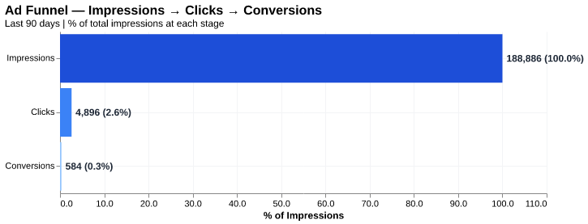
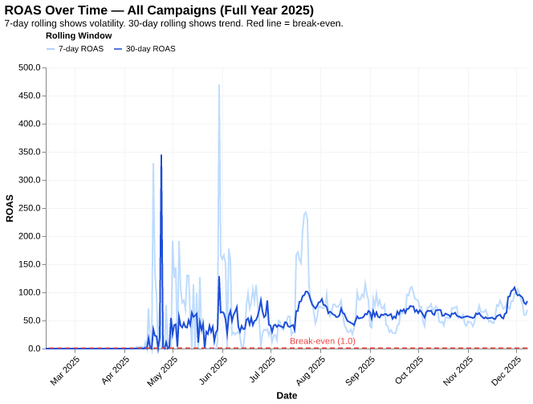
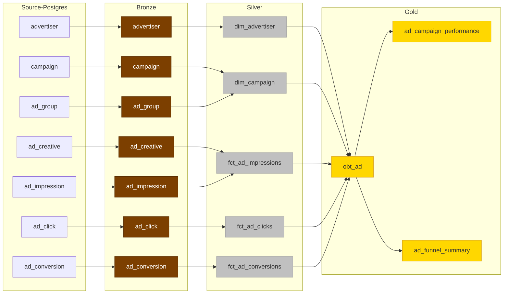

# E-Commerce Ad Analytics Warehouse


A production-grade medallion data warehouse built on PySpark + Apache Iceberg, ingesting ad event data from Postgres and delivering performance metrics to marketing stakeholders.

---

## Stakeholders & Outcomes

Our stakeholders couldn't answer core business questions from Postgres directly — too slow, too raw, no aggregations.

| Stakeholder | Core Question | Key Metrics |
|---|---|---|
| **Marketing Agents** | Is my spend efficient, and where is the funnel leaking? | ROAS, CVR, CPA, CTR, rolling l7d/l30d/l90d CVR |

| Metric | Formula |
|---|---|
| **ROAS** | `total_revenue / total_spend` |
| **CTR** | `total_clicks / total_impressions` |
| **CVR** | `total_conversions / total_clicks` |
| **CPA** | `total_spend / total_conversions` |
| **l7d / l30d / l90d CVR** | Rolling window CVR over last 7, 30, 90 days |

---

## Results

### Ad Funnel — Where Customers Drop Off


### ROAS Over Time — Ad Spend Efficiency


---

## Architecture

A `medallion architecture` ingesting 7 Postgres ad tables into Bronze → Silver → Gold.


**Key design principles:**
- **Separation of concerns** — raw ingestion, correctness, and aggregation are independent layers
- **Idempotency** — any window can be rerun without data corruption via `overwritePartitions()`
- **Schema evolution safety** — explicit `SELECT col1, col2` everywhere, never `SELECT *`
- **Replay without Postgres** — Bronze decouples Silver/Gold from source availability

---

## Code Pattern

Every script follows a strict 4-function pattern:
```python
extract(spark, start_time, end_time) → dict[str, DataFrame]
transform(input_dfs)                 → DataFrame
validate(output_df, spark)           → bool     
load(output_df, spark)               → None
```

**Bronze** — Full snapshot load.

**Silver dims** — `createOrReplace()` on every run. Enrichment is computed at this layer.

**Silver facts** — Incremental by `created_at` window, partitioned by `created_at`. `overwritePartitions()` makes reruns safe (**idempotent**) and handles late-arriving events.

**Gold OBT** — Wide impression-grain table joining all Silver facts and dims. Incremental load with `overwritePartitions()`.

**Gold summaries** — Aggregate from OBT. Full `createOrReplace()` on every run for maintainability.

---

## Data Quality

Validation uses Soda Core contracts following the `WAP (Write-Audit-Publish) pattern.`

Checks are defined in per-table YAML contracts under `gold/contracts/`:

| Table | Checks |
|---|---|
| `ad_campaign_performance` | `row_count > 0`, no nulls on `campaign_id` + `event_date`, `total_spend >= 0`, `roas >= 0` |
| `ad_funnel_summary` | `row_count > 0`, no nulls on `ad_group_id` + `event_date`, `total_spend >= 0`, `cvr` between 0 and 1 |